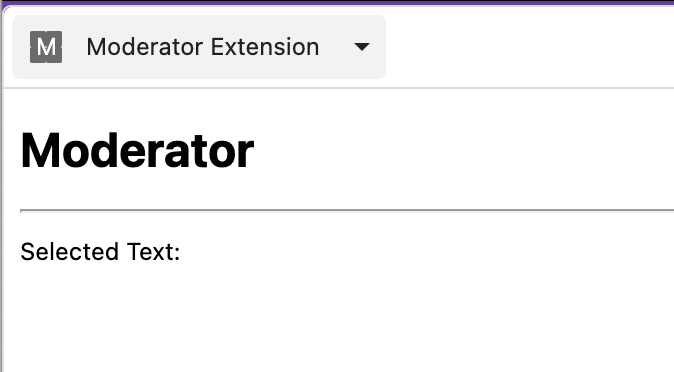

# Moderator Chrome Extension

The Moderator Chrome Extension is an experimentation tool (implemented as a Chrome Extension) for examining selected text from web pages using the OpenAI Moderation API. This extension integrates with the Chrome context menu and provides a side panel for displaying moderation results.

## Table of Contents

- [Installation](#installation)
- [Setting Options](#setting-options)
- [Usage](#usage)
- [Theory of Operation](#theory-of-operation)

## Installation

1. Download or clone the repository containing the extension code.
2. Open the Google Chrome browser.
3. Navigate to `chrome://extensions/` using the address bar.
4. Enable the "Developer mode" toggle located at the top-right corner.
5. Click the "Load unpacked" button and select the folder containing the extension code.

## Setting Options

To use the extension, you need to set your OpenAI API key in the extension's own options page:

1. Click on the three-dot menu icon in the top-right corner of Chrome.
2. Navigate to "Extensions" and find the "Moderator Extension" entry.
3. Click on "Options" to access the extension settings.
4. In the "OpenAI API Key" field, enter your valid OpenAI API key.
5. Click the "Save" button to store the API key.

#### Security of API Key

The OpenAI API key is stored securely using Chrome's `chrome.storage.sync` API. This means that the key is stored locally on your machine and is not accessible to websites or other extensions. It is used only by the extension to communicate with the OpenAI API. When you uninstall the extension the key will be removed from local storage and you will need to enter it again in the options menu as described above. 

## Usage

1. After installing the extension, you can right-click on any selected text within a web page.
2. In the context menu, click on the "Process with Moderator" option.
3. The side panel will open, displaying the selected text and moderation results if an OpenAI API key is provided.

## Theory of Operation

The Moderator Extension leverages Chrome's context menu and side panel capabilities to provide a seamless experience for moderating selected text.

### Context Menu and Background Script

- The extension uses the [`contextMenus`](background.js) permission to create a context menu item named "Process with Moderator" that appears when you select text within a web page.
- The [`background.js`](background.js) script handles the creation of the context menu item using the `chrome.contextMenus` API.
- When you click the "Process with Moderator" context menu item, the `chrome.contextMenus.onClicked` listener is triggered.
- The listener retrieves the selected text and the OpenAI API key from the storage using the `chrome.storage.sync.get` method.
- It then sends a message to the side panel using the `chrome.runtime.sendMessage` method, passing the selected text and API key.

### Side Panel and Side Panel Script

- The side panel is implemented using the [`sidepanel.html`](sidepanel.html) file.
- The `sidepanel.html` file defines the content of the side panel, including placeholders for the selected text and moderation results.
- The [`sidepanel.js`](sidepanel.js) script listens for messages from the background script using the `chrome.runtime.onMessage` listener.
- If a message with the name "update-side-panel" is received, the script hides the instruction and displays the selected text.
- If a valid OpenAI API key is provided, the script calls the `callModerationAPI` function using the `fetch` API.
- The moderation result is then displayed in the side panel, showing the categories and scores returned by the API.

## Example Moderation using the Extension

To demonstrate the capabilities of the Moderator Chrome Extension, you can test it using OpenAI's sample content provided in their [Moderations API documentation](https://platform.openai.com/docs/api-reference/moderations/create). On this page, you'll find a sample "input" content that you can use to see how the extension moderates and displays the results.

Follow these steps to test the extension with the sample content:

1. Visit the [OpenAI Moderations API documentation](https://platform.openai.com/docs/api-reference/moderations/create).
2. On the documentation page, find the sample "input" content provided.
3. Select the sample text using your mouse to highlight it.
4. Right-click on the selected text to open the context menu.
5. In the context menu, click on the "Process with Moderator" option.
6. Open the Side Panel in Chrome by clicking on the Side Panel icon in the upper right part of the browser. From there you will need to select "Moderator Extension" from the drop down in order to see the output of this extension's side panel handlers. 
7. In the side panel, you should see the selected text displayed along with the categories and scores obtained from the OpenAI Moderations API.

You can compare the results from the extension with the values in the OpenAI examples to confirm that the models are generally working as one would expect. 

## APIs Used in this Extension

The Moderator Chrome Extension utilizes several Chrome Extension APIs to provide its functionality:

- **`contextMenus` API:** This API allows the extension to create custom context menu items that appear when you right-click on selected text within a web page. The extension uses this API to create the "Process with Moderator" context menu item, which triggers the moderation process.

- **`chrome.storage.sync` API:** The extension uses this API to securely store and retrieve the OpenAI API key provided by the user. The key is stored locally and is not accessible to websites or other extensions.

- **`chrome.runtime` API:** This API enables communication between different parts of the extension, including the background script and the side panel script. It allows messages to be sent and received between these components.

- **`side_panel` API:** The side panel feature is implemented using the `side_panel` API, which provides a way to create a custom side panel that can be opened alongside web content. The extension uses this API to display the moderation results in a separate panel.

For moderating the selected text, the extension utilizes the **OpenAI Moderations API**, which is a content moderation system designed to help prevent content that violates OpenAI's usage policies from being shown. You can learn more about the OpenAI Moderations API in the [official documentation](https://platform.openai.com/docs/api-reference/moderations).

To understand how each API is used in the extension's code, refer to the corresponding files: [`background.js`](background.js), [`options.js`](options.js), [`sidepanel.js`](sidepanel.js).

